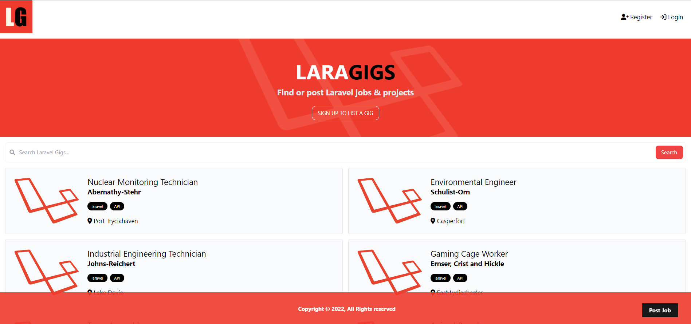

# Laragigs for Listings


## Usage
### Database Setup
- This project use MySQL.
- Make sure that the DB Config is correct.
- Add your credentials to `env` file

### Migration and Seeding
To create all tables and add dummy data, run this
```
php artisan serve migrate --seed
```

### File Uploading
When uploading files, they go to "storage/app/public". 
Create a symlink with the following command to make them publicly accessible

```
php artisan storage:link
```
### Run Your App
```
php artisan serve
```
